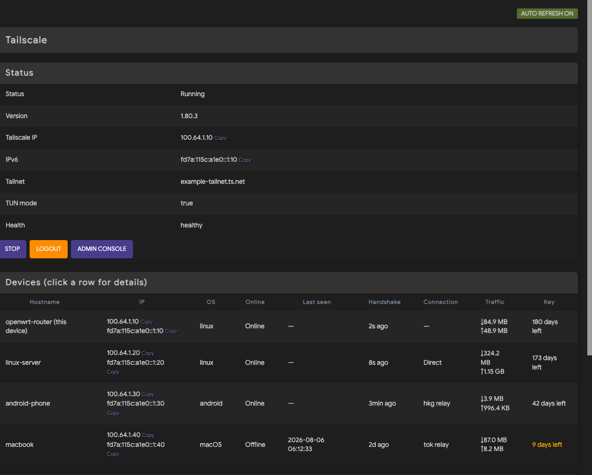

# luci-app-tailscale-lua

**English** | [简体中文](README.zh-CN.md)

A full-featured Tailscale management page for **Lua-based LuCI** — an
alternative to the official JS app (`luci-app-tailscale-community`) for custom
OpenWrt builds whose LuCI is Lua-only and ignores `/usr/share/luci/menu.d/*.json`
(e.g. **BleachWrt**). Includes the page, the backend dependency fixes, and
standard LuCI i18n (Simplified Chinese included).

## Screenshot



*Screenshot shows sanitized demo data.*

## Features

- **Status card** — state / version / Tailscale IP (v4+v6, one-click copy) / Tailnet / TUN mode / health
- **Device table** — this device pinned on top; per device: IPs (each with its own copy button), last handshake, direct/relay connection, traffic, key expiry days (orange < 30d, red when expired)
- **Detail panel (tabs)** — click a row to expand: Overview / Connection / Traffic / Security (node public key, key expiry, allowed IPs, exit node options)
- **Logs** — live tailscaled syslog, polled every 5 s, auto-scroll (does not disturb you while reading up)
- **Control** — start/stop toggle, login (auth link auto-displayed with open/copy buttons, optional Auth Key), logout
- **Admin console link** — one click to `console.tailscale.com/admin/machines` (ZeroTier style)
- **Polling** — status/table/logs refresh every 5 s; the detail panel keeps the data from when it was opened (not re-rendered by polls)
- **i18n** — standard LuCI translations in `po/` (Simplified Chinese included); `luci-i18n-tailscale-lua-zh-cn` is generated by the build system

## Dependencies

```
+tailscale +luci-base +luci-lua-runtime +libubus-lua +rpcd-mod-ucode +ucode-mod-uci
```

> **Important**: the rpcd `tailscale` ubus object is provided by the ucode
> backend shipped with the official package. It needs `rpcd-mod-ucode` and
> `ucode-mod-uci` to load. On BleachWrt, also upgrade `libubox20240329` to
> 2025.07+ or the ucode module will fail to dlopen. If
> `ubus list | grep tailscale` is empty after installing, check these.

## Download

```bash
git clone https://github.com/Sofronio/luci-app-tailscale-lua
# or
wget https://github.com/Sofronio/luci-app-tailscale-lua/archive/refs/heads/main.tar.gz
tar xzf main.tar.gz
```

## Installation

**Option A — direct copy (on the router, from this repo)**

```bash
opkg update
opkg install rpcd-mod-ucode ucode-mod-uci     # libubox: opkg upgrade libubox20240329 if needed
/etc/init.d/rpcd restart

scp -r root/usr/lib/lua/luci/controller/tailscale.lua  root@ROUTER:/usr/lib/lua/luci/controller/
scp -r root/usr/lib/lua/luci/view/tailscale.htm        root@ROUTER:/usr/lib/lua/luci/view/

./tools/build-lmo.sh                                   # builds tailscale.zh-cn.lmo
scp tailscale.zh-cn.lmo root@ROUTER:/usr/lib/lua/luci/i18n/
```

**Option B — OpenWrt SDK build (for packaging as .ipk)**

```bash
git clone https://github.com/openwrt/luci   # or your SDK checkout
cp -r luci-app-tailscale-lua luci/applications/
cd luci && make package/luci-app-tailscale-lua/compile
# artifacts: luci-app-tailscale-lua_*.ipk + luci-i18n-tailscale-lua-zh-cn_*.ipk
```

Open LuCI → **VPN → Tailscale**.

## First login (cold start)

1. Click **Start** — tailscaled runs, state shows "Logged out"
2. The auth link (`login.tailscale.com/a/...`) appears automatically under the
   buttons — click **Open auth link** or **Copy link**
3. Approve in the browser; the device joins the tailnet and the page flips to "Running"
4. Or use an **Auth Key**: generate `tskey-...` in the admin console, paste it
   into the box next to Login, then click Login

> The auth URL is printed by tailscaled to the syslog; the page captures it by
> polling the log, so no SSH is needed. New nodes are denied access by default
> until approved in the admin console.

## Translations

PO sources live in `po/`. The SDK build generates the `luci-i18n-*` subpackages
automatically. For direct-copy installs, this repo ships the official `po2lmo`
tool (compiled from `openwrt/luci openwrt-24.10`, `modules/luci-base/src/po2lmo.c`):

```bash
./tools/build-lmo.sh
```

## Demo / screenshot mode

For documentation screenshots the page can return fully sanitized fake data
(no real hostnames/IPs) — no real data leaves the router:

```bash
uci set tailscale.settings.demo=1 && uci commit tailscale   # fake data
uci set tailscale.settings.demo=0 && uci commit tailscale   # back to real
```

## Known limitations

- Per-device client version (`ClientVersion`) is not exposed in
  `tailscale status --json` peer objects; the detail page shows "—" (data source limit)
- Logs come from syslog (`logread`); history beyond the ring buffer is unavailable
- The page relies on LuCI's legacy `xhr.js` (`XHR.get`/`XHR.poll`), bundled with all standard LuCI builds

## License

Apache License 2.0 — see [LICENSE](LICENSE).
