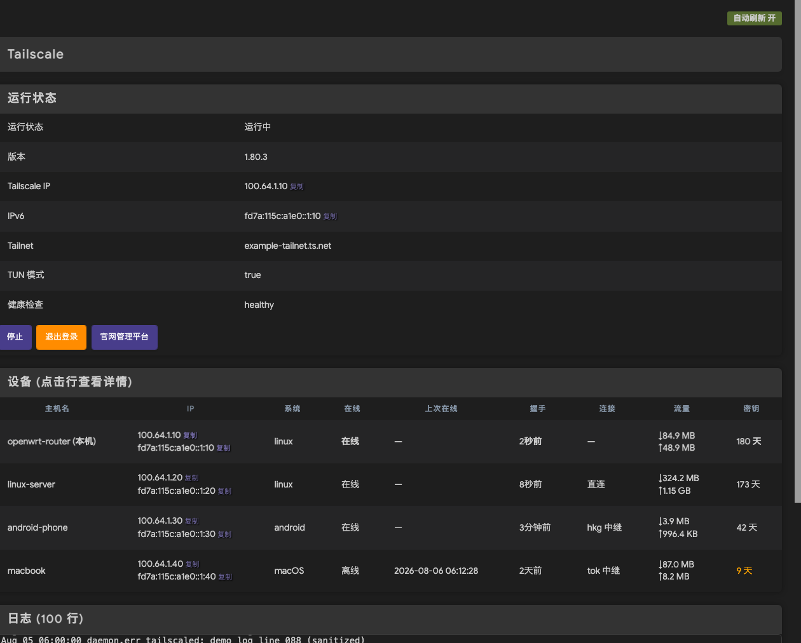

# luci-app-tailscale-lua

[English](README.md) | **简体中文**

适用于 **Lua-only LuCI** 固件的 Tailscale 管理页面 —— 官方 JS 版
(`luci-app-tailscale-community`)在纯 Lua LuCI(如 **BleachWrt**)上无法注册
菜单,本包是完整替代方案:页面本体 + 后端依赖修复 + 标准 LuCI i18n(含简体中文)。

## 截图



*截图为脱敏演示数据。*

## 特性

- **状态卡** — 运行状态 / 版本 / Tailscale IP(v4+v6,一键复制)/ Tailnet / TUN 模式 / 健康检查
- **设备表** — 本机置顶;每台设备:IP(每个独立复制按钮)、上次握手、直连/中继、流量、密钥剩余天数(30 天内橙色,过期标红)
- **详情面板(Tab)** — 点击设备行展开:概览 / 连接 / 流量 / 安全(节点公钥、密钥过期、允许路由、出口节点选项)
- **日志** — tailscaled 实时 syslog,5 秒轮询,自动滚底(向上阅读时不打扰)
- **控制** — 启动/停止切换按钮、登录(认证链接自动显示 + 打开/复制按钮,支持 Auth Key)、退出登录
- **官网入口** — 一键跳转 `console.tailscale.com/admin/machines`(ZeroTier 风格)
- **轮询** — 状态/设备/日志每 5 秒自动刷新;详情面板使用打开时的缓存数据,不被轮询打断
- **i18n** — 标准 LuCI 翻译(`po/` 目录,含简体中文),构建时自动生成 `luci-i18n-tailscale-lua-zh-cn`

## 依赖

```
+tailscale +luci-base +luci-lua-runtime +libubus-lua +rpcd-mod-ucode +ucode-mod-uci
```

> **重要**:rpcd 的 `tailscale` ubus 对象由官方包自带的 ucode 后端提供,
> 需要 `rpcd-mod-ucode` + `ucode-mod-uci` 才能加载。在 BleachWrt 上还建议把
> `libubox20240329` 升级到 2025.07+,否则 ucode 模块无法 dlopen。
> 若 `opkg install` 后 `ubus list | grep tailscale` 为空,按此排查。

## 下载

```bash
# 压缩包(推荐,含预编译中文翻译)
wget https://github.com/Sofronio/luci-app-tailscale-lua/raw/main/dist/luci-app-tailscale-lua-1.0.0.tar.gz
# 或完整仓库
git clone https://github.com/Sofronio/luci-app-tailscale-lua
```

## 安装

**方式一:WebUI 上传压缩包(最简单)**

1. 下载 `dist/luci-app-tailscale-lua-1.0.0.tar.gz`
2. LuCI **系统 → FileTransfer**(或其他网页上传入口)上传到路由器(如 `/tmp`)
3. SSH/TTYD 里解压并拷贝:

```bash
cd /tmp && tar xzf luci-app-tailscale-lua-1.0.0.tar.gz
cd luci-app-tailscale-lua
opkg update && opkg install rpcd-mod-ucode ucode-mod-uci   # 后端依赖
cp -f root/usr/lib/lua/luci/controller/tailscale.lua /usr/lib/lua/luci/controller/
cp -f root/usr/lib/lua/luci/view/tailscale.htm        /usr/lib/lua/luci/view/
cp -f tailscale.zh-cn.lmo                             /usr/lib/lua/luci/i18n/
/etc/init.d/rpcd restart
```

**方式二:电脑命令行(把 IP 换成你路由器的)**

```bash
# 把 192.168.1.1 换成你路由器的 IP
ROUTER=192.168.1.1
wget https://github.com/Sofronio/luci-app-tailscale-lua/raw/main/dist/luci-app-tailscale-lua-1.0.0.tar.gz
tar xzf luci-app-tailscale-lua-1.0.0.tar.gz
scp -r luci-app-tailscale-lua/root/usr/lib/lua/luci/controller/tailscale.lua root@$ROUTER:/usr/lib/lua/luci/controller/
scp -r luci-app-tailscale-lua/root/usr/lib/lua/luci/view/tailscale.htm        root@$ROUTER:/usr/lib/lua/luci/view/
scp -r luci-app-tailscale-lua/tailscale.zh-cn.lmo                            root@$ROUTER:/usr/lib/lua/luci/i18n/
ssh root@$ROUTER "opkg update && opkg install rpcd-mod-ucode ucode-mod-uci && /etc/init.d/rpcd restart"
```

**方式三:路由器命令行(不需要 scp)**

```bash
cd /tmp
wget https://github.com/Sofronio/luci-app-tailscale-lua/raw/main/dist/luci-app-tailscale-lua-1.0.0.tar.gz
tar xzf luci-app-tailscale-lua-1.0.0.tar.gz && cd luci-app-tailscale-lua
opkg update && opkg install rpcd-mod-ucode ucode-mod-uci
cp -f root/usr/lib/lua/luci/controller/tailscale.lua /usr/lib/lua/luci/controller/
cp -f root/usr/lib/lua/luci/view/tailscale.htm        /usr/lib/lua/luci/view/
cp -f tailscale.zh-cn.lmo                             /usr/lib/lua/luci/i18n/
/etc/init.d/rpcd restart
```

打开 LuCI → **VPN → Tailscale**。

## 首次登录(冷启动)

1. 点击 **启动** —— tailscaled 开始运行,状态变为"已退出登录"
2. 按钮下方**自动显示认证链接**(`login.tailscale.com/a/...`),点"打开认证链接"或"复制链接"
3. 浏览器批准后,设备加入 Tailnet,页面自动变为"运行中"
4. 或使用 **Auth Key**:在官网控制台生成 `tskey-...`,粘贴到登录框再点登录

> 认证链接由 tailscaled 打印到系统日志,页面通过轮询日志自动抓取并显示,
> 无需 SSH 操作。新接入节点默认不允许访问,需在官网控制台批准/配置。

## 翻译

翻译源在 `po/`,SDK 构建自动生成 `luci-i18n-*` 子包。直接拷贝安装时,
仓库附带了从 `openwrt/luci openwrt-24.10` 分支编译的官方 `po2lmo`
(`modules/luci-base/src/po2lmo.c`):

```bash
./tools/build-lmo.sh
```

## 演示/截图模式

用于文档截图:页面返回完全脱敏的假数据(无真实主机名/IP),真实数据不出路由器:

```bash
uci set tailscale.settings.demo=1 && uci commit tailscale   # 假数据
uci set tailscale.settings.demo=0 && uci commit tailscale   # 恢复真实
```

## 已知限制

- 每台设备的客户端版本(`ClientVersion`)在 `tailscale status --json` 的
  Peer 对象中不提供,详情页显示 "—"(数据源限制)
- 日志来自 syslog(`logread`),环形缓冲区外的历史不可得
- 页面依赖 LuCI 内置的 legacy `xhr.js`(`XHR.get`/`XHR.poll`),标准 LuCI 均自带

## License

Apache License 2.0 — 详见 [LICENSE](LICENSE)。
